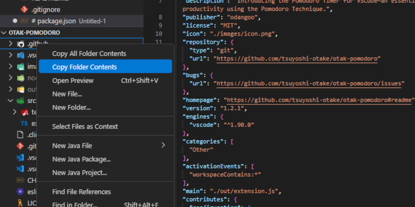
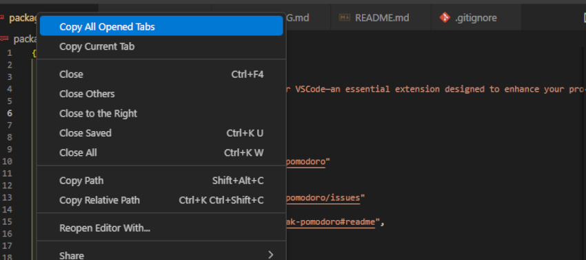
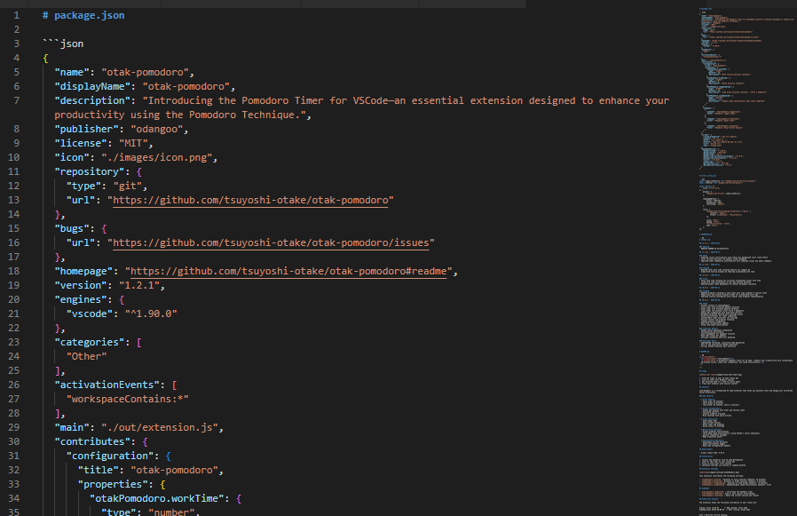

  <h1 align="center">otak-clipboard</h1>
  

    Copy files and their content directly to your clipboard from VS Code, seamlessly formatted in markdown—perfect for generative AI interaction.
  

---

## Usage

For Explorer:

1. Right-click a file or folder in the VS Code Explorer.
2. Select one of the following commands from the context menu:
   - **Copy File** (for single files)
   - **Copy Folder Contents** (copies immediate folder contents, without probing subfolders)
   - **Copy All Folder Contents** (copies entire folder recursively, including all subdirectories)
3. The content and structure of the files/folders will be formatted as markdown text, ready on your clipboard.

For Tabs:

1. Right-click on the active editor tab or in the editor tab area.
2. Select from the following commands:
   - **Copy Current Tab** (copies currently displayed tab's content)
   - **Copy All Opened Tabs** (copies all open tabs' content, including non-active or non-visible tabs from all tab groups)
3. The tab contents will be converted to markdown format with syntax highlighting and copied to your clipboard.

## Features  

otak-clipboard simplifies copying file contents and file structures with intelligent markdown formatting, designed specifically for contexts where generative AI tools are used.

### Key Features  

- **Context Menu Integration**:
  - *Editor context menu*:
    - **Copy current tab** content  
    - **Copy content of all opened tabs** (including tabs not actively visible)
  - *Explorer context menu*:
    - **Copy single file** content  
    - **Copy immediate folder contents** (files directly under the selected folder only)  
    - **Copy folder contents recursively** (including files and folders at all nested levels)

- **Smart File Processing**:
  - Markdown-enhanced output with syntax highlighting based on file types  
  - File paths clearly included for context awareness  

- **Protection & Limits**:
  - Maximum character limit per copy operation (**default: 400,000 chars ≈100K tokens**)  
  - Maximum file limit per operation (**default: 200 files**)
  - Intelligent binary file detection:
      - Multi-level binary checks (**magic numbers**, **null bytes**, **control character ratio**)  
      - File extension-based overrides configurable  
      - Includes `.gitignore` integration to auto-exclude specified files (configurable)  
  - Binary files will be listed clearly without including their content

- **User-Friendly Notifications**:
  - VSCode native progress API displays friendly status messages automatically dismissed after **5 seconds**  
  - Messages include clear workspace-relative file paths  

## Requirements  

- Visual Studio Code **^1.90.0**

## Installation  

1. Install from the VS Code Marketplace or VSIX package.
2. Right-click files, folders, or use editor tab context menus.
3. Instantly have markdown-formatted output on your clipboard.

## Extension Settings  

otak-clipboard provides highly configurable options:

- `otakClipboard.maxCharacters`: Maximum allowed characters to copy (**default: 400000**).
- `otakClipboard.maxFiles`: Maximum number of files allowed per operation (**default: 400**).
- `otakClipboard.excludeDirectories`: Directories always excluded (e.g., **`.git`, `node_modules`, `out`**).
- `otakClipboard.knownTextExtensions`: Extensions always treated as text.
- `otakClipboard.knownBinaryExtensions`: Extensions always treated as binary.
- `otakClipboard.binaryDetectionRules`: Configurable rules for binary detection, including:
  - `nullByteCheck`: Null bytes detection to identify binary files.
  - `controlCharRatio`: Maximum allowed control character ratio in text files.
  - `controlCharCheck`: Toggle control character check.

## Commands  

- `otakClipboard.copyCurrentTab`: Copy content of current active editor tab  
- `otakClipboard.copyAllOpenedTabs`: Copy content of all open editor tabs (in all tab groups)  
- `otakClipboard.copyFile`: Copy the selected file's content via explorer menu  
- `otakClipboard.copyFolder`: Copy immediate folder contents from explorer (non-recursive)  
- `otakClipboard.copyFolderRecursive`: Copy whole folder contents recursively via explorer menu  

## Clipboard Output Example

## Notifications  

Notifications clearly inform about actions performed:

1. **Copy Operation**:
    - Detailed paths of copied files/folders (workspace-relative)
    - Automatic dismiss after 5 seconds

2. **Limit Exceeded**:
    - Clear message when operation exceeds character/file limits
    - Helpful guidance about restrictions  

## Related Extensions
Check out our other VS Code extensions.

### [otak-monitor](https://marketplace.visualstudio.com/items?itemName=odangoo.otak-monitor)
Real-time system monitoring in VS Code. Track CPU, memory, and disk usage through the status bar with comprehensive tooltips and 1-minute averages.

### [otak-proxy](https://marketplace.visualstudio.com/items?itemName=odangoo.otak-proxy)
One-click proxy configuration for VS Code and Git. Perfect for environments where network settings change frequently.

### [otak-committer](https://marketplace.visualstudio.com/items?itemName=odangoo.otak-committer)
Intelligent SCM operations with AI support. Features multilingual commit message generation (25 languages supported) and upcoming PR management capabilities.

### [otak-restart](https://marketplace.visualstudio.com/items?itemName=odangoo.otak-restart)
Quick restart operations for Extension Host and VS Code window via status bar tooltip. Streamlines your development workflow.

### [otak-clock](https://marketplace.visualstudio.com/items?itemName=odangoo.otak-clock)
Display date and time for two time zones from around the world in VS Code. Essential for working across different time zones.

### [otak-pomodoro](https://marketplace.visualstudio.com/items?itemName=odangoo.otak-pomodoro)
Enhance your productivity with this Pomodoro Timer extension. Helps balance focused work sessions with refreshing breaks using the Pomodoro Technique.

### [otak-zen](https://marketplace.visualstudio.com/items?itemName=odangoo.otak-zen)
Experience a distraction-free workflow with otak-zen. This extension transforms your VS Code interface into a minimalist environment by hiding non-essential UI elements, allowing you to focus solely on coding. Customize which components to show or hide, and toggle zen mode quickly via commands or the status bar.

## License

This project is licensed under the MIT License - see the [LICENSE](LICENSE) file for details.

---

For more information, visit the [GitHub repository](https://github.com/tsuyoshi-otake/otak-clipboard).

Part of the [otak-series](https://marketplace.visualstudio.com/search?term=otak&target=VSCode) VS Code extensions.
