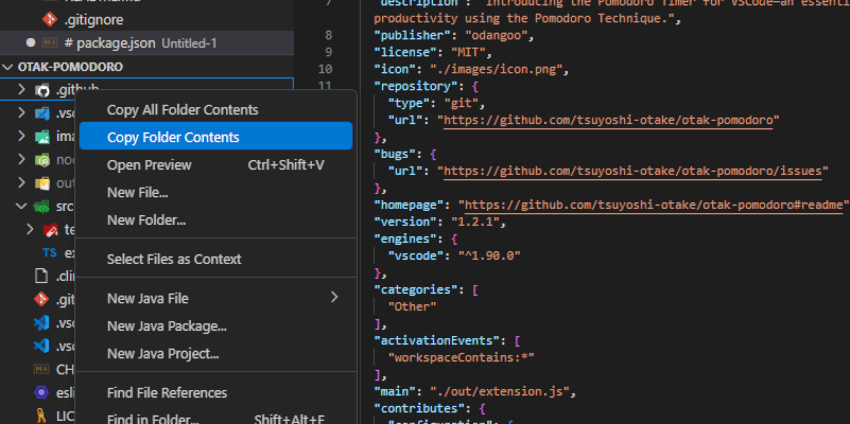
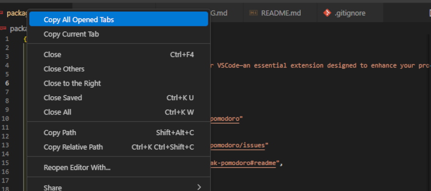
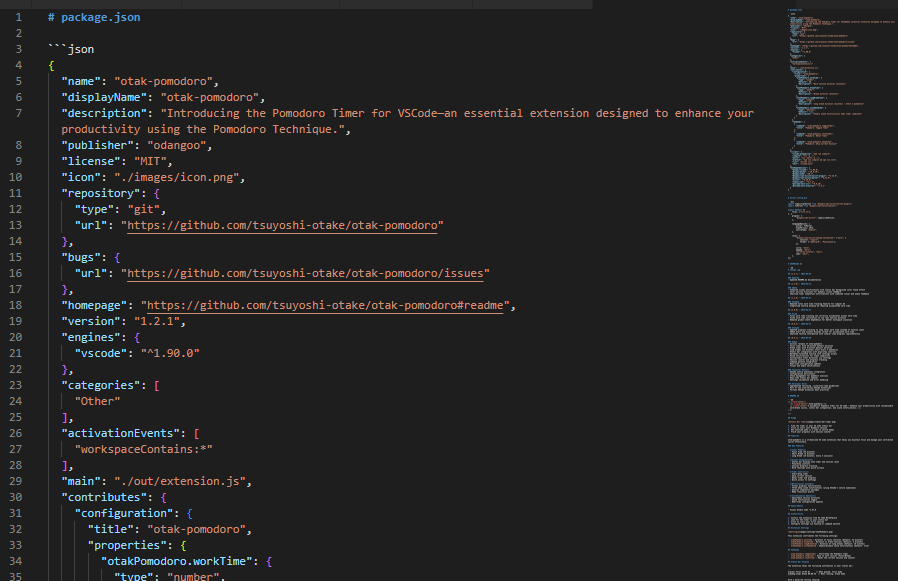

  <h1 align="center">otak-clipboard</h1>
  

    Copy files and directories to your clipboard directly from VS Code, formatted as markdown—perfect for AI-powered development workflows.
  

---

## 🔐 Security Feature: Automatic Sensitive Data Detection

otak-clipboard now includes intelligent detection of API keys, tokens, and other sensitive information. When copying code, the extension automatically scans for:

- **API Keys & Tokens**: AWS, Azure, GCP, OpenAI, Anthropic, GitHub, Stripe, and more
- **Authentication Credentials**: JWT tokens, OAuth tokens, passwords, and private keys
- **Connection Strings**: Database URLs and webhook endpoints

When sensitive data is detected, you'll receive a warning with options to:
- Mask all sensitive data automatically
- Review and mask items individually
- Continue without masking (with confirmation)

This feature helps prevent accidental exposure of credentials when sharing code with AI assistants or colleagues. You can disable this feature or customize detection patterns in the extension settings.

## Usage

For Explorer:

1. Right-click any file or folder in the VS Code Explorer.
2. Select one of these commands from the context menu:
   - **Copy File** (single file)
   - **Copy Folder Contents** (immediate children only)
   - **Copy All Folder Contents** (recursive copy including all subdirectories)
3. The selected content is instantly formatted as markdown and copied to your clipboard.

For Tabs:

1. Right-click any editor tab or the tab bar area.
2. Choose from:
   - **Copy Current Tab** (active tab only)
   - **Copy All Opened Tabs** (all tabs across all groups)
3. Tab contents are formatted as markdown with syntax highlighting and copied to your clipboard.

## Features

otak-clipboard streamlines sharing code with AI assistants by intelligently formatting file contents as markdown.

### Key Features

- **Context Menu Integration**:
  - *Editor context menu*:
    - Copy current tab
    - Copy all open tabs (across all tab groups)
  - *Explorer context menu*:
    - Copy single file
    - Copy folder contents (shallow)
    - Copy folder contents (recursive)

- **Smart File Processing**:
  - Automatic syntax highlighting based on file type
  - Includes file paths for context

- **Built-in Safeguards**:
  - Character limit: **400,000 chars** (≈100K tokens)
  - File limit: **200 files** per operation
  - Intelligent binary file detection:
      - Magic number validation
      - Null byte detection
      - Control character analysis
      - Configurable file extension rules
      - `.gitignore` support (optional)
  - Binary files are listed but content is excluded

- **User-Friendly Notifications**:
  - Clear progress indicators with auto-dismiss (5 seconds)
  - Workspace-relative paths for easy navigation  

## Requirements

- Visual Studio Code 1.90.0 or higher

## Installation

1. Install from the VS Code Marketplace or via VSIX package
2. Right-click files, folders, or editor tabs to access commands
3. Copied content is instantly available as markdown on your clipboard

## Extension Settings

Customize otak-clipboard behavior through VS Code settings:

### General Settings
- `otakClipboard.maxCharacters`: Maximum characters per copy (default: 400000)
- `otakClipboard.maxFiles`: Maximum files per operation (default: 400)
- `otakClipboard.excludeDirectories`: Directories to always exclude (e.g., `.git`, `node_modules`, `out`)

### Security Settings
- `otakClipboard.detectSensitiveData`: Enable/disable sensitive data detection (default: true)
- `otakClipboard.maskShowPartial`: Show partial values when masking (e.g., `sk-proj-****xyz`) (default: true)
- `otakClipboard.sensitiveDataPatterns`: Add custom detection patterns for your specific needs

### File Detection Settings
- `otakClipboard.knownTextExtensions`: File extensions to treat as text
- `otakClipboard.knownBinaryExtensions`: File extensions to treat as binary
- `otakClipboard.binaryDetectionRules`: Fine-tune binary file detection:
  - `nullByteCheck`: Enable null byte detection
  - `controlCharRatio`: Maximum control character ratio for text files
  - `controlCharCheck`: Enable control character checking

## Commands

- `otakClipboard.copyCurrentTab`: Copy active editor tab
- `otakClipboard.copyAllOpenedTabs`: Copy all open tabs (all groups)
- `otakClipboard.copyFile`: Copy selected file from Explorer
- `otakClipboard.copyFolder`: Copy folder contents (shallow)
- `otakClipboard.copyFolderRecursive`: Copy folder contents (recursive)  

## Clipboard Output Example

## Notifications

Clear feedback for every action:

1. **Copy Success**:
    - Shows which files/folders were copied
    - Auto-dismisses after 5 seconds

2. **Limit Exceeded**:
    - Explains why the operation was limited
    - Provides guidance on adjusting settings  

## Related Extensions
Check out our other VS Code extensions:

### [otak-monitor](https://marketplace.visualstudio.com/items?itemName=odangoo.otak-monitor)
Real-time system monitoring in VS Code. Track CPU, memory, and disk usage with 1-minute averages in the status bar.

### [otak-proxy](https://marketplace.visualstudio.com/items?itemName=odangoo.otak-proxy)
One-click proxy configuration for VS Code and Git. Perfect for switching between network environments.

### [otak-committer](https://marketplace.visualstudio.com/items?itemName=odangoo.otak-committer)
AI-powered commit message generation supporting 25 languages with upcoming PR management features.

### [otak-restart](https://marketplace.visualstudio.com/items?itemName=odangoo.otak-restart)
Quick restart controls for Extension Host and VS Code window from the status bar.

### [otak-clock](https://marketplace.visualstudio.com/items?itemName=odangoo.otak-clock)
Display two time zones simultaneously in VS Code. Essential for global collaboration.

### [otak-pomodoro](https://marketplace.visualstudio.com/items?itemName=odangoo.otak-pomodoro)
Boost productivity with the Pomodoro Technique. Balance focused work sessions with scheduled breaks.

### [otak-zen](https://marketplace.visualstudio.com/items?itemName=odangoo.otak-zen)
Create a distraction-free coding environment. Hide non-essential UI elements and customize your minimal workspace.

## License

MIT License - see [LICENSE](LICENSE) for details.

---

Visit the [GitHub repository](https://github.com/tsuyoshi-otake/otak-clipboard) for more information.

Part of the [otak-series](https://marketplace.visualstudio.com/search?term=otak&target=VSCode) VS Code extensions.
